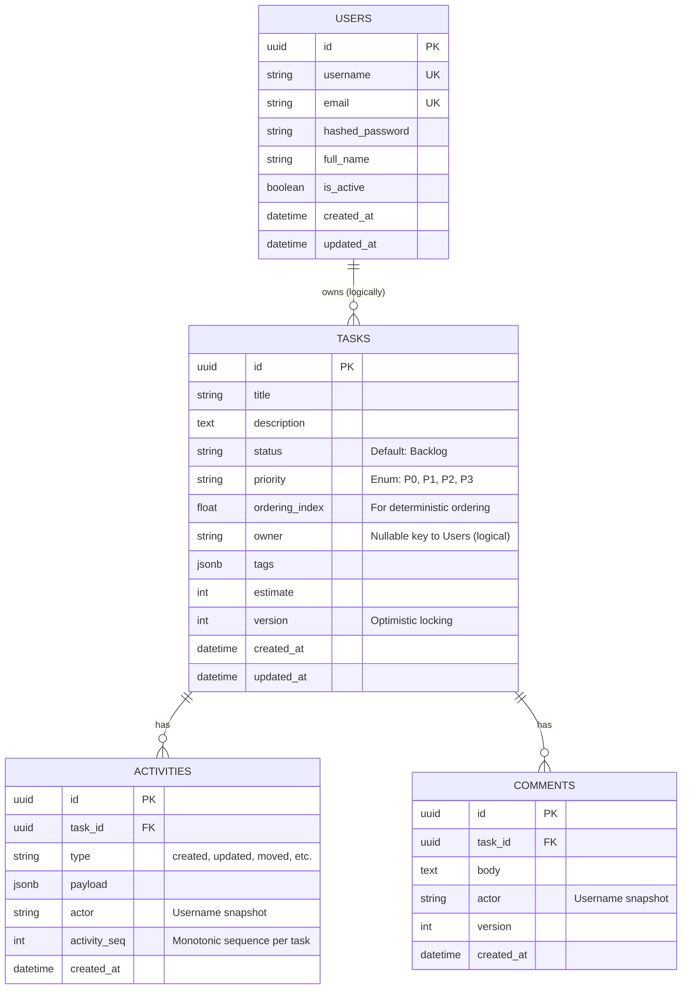

# Database Schema

This document outlines the database schema for the Task Board application.

## Entity Relationship Diagram (ERD)

## Tables Detail

### `users`
Stores user authentication and profile information.
- **id**: Unique identifier (UUID).
- **username**: Unique username for login and display.
- **email**: Unique email address.
- **hashed_password**: Bcrypt hash of the password.

### `tasks`
The core entity representing a unit of work.
- **status**: Current column in the Kanban board (Backlog, Ready, In Progress, Review, Done).
- **ordering_index**: A floating-point number used to determine the order of tasks within a column.
- **version**: Incremented on every update to prevent lost updates (Optimistic Concurrency Control).

### `activities`
An append-only log of all actions performed on a task.
- **payload**: JSONB field storing details about the change (e.g., old vs new values).
- **activity_seq**: A sequence number monotonic relative to the task, ensuring a consistent history timeline.

### `comments`
User comments attached to a task.
- **actor**: Snapshots the username of the commenter at the time of creation.
